# Synthetic Generation of Plant Dataset Using GANs
## DataSet Preparation
### Foreground Segmentation using Instance Segmentation

    
    
    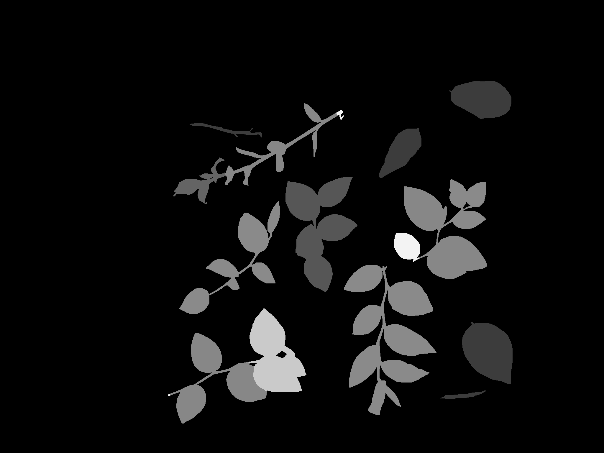
    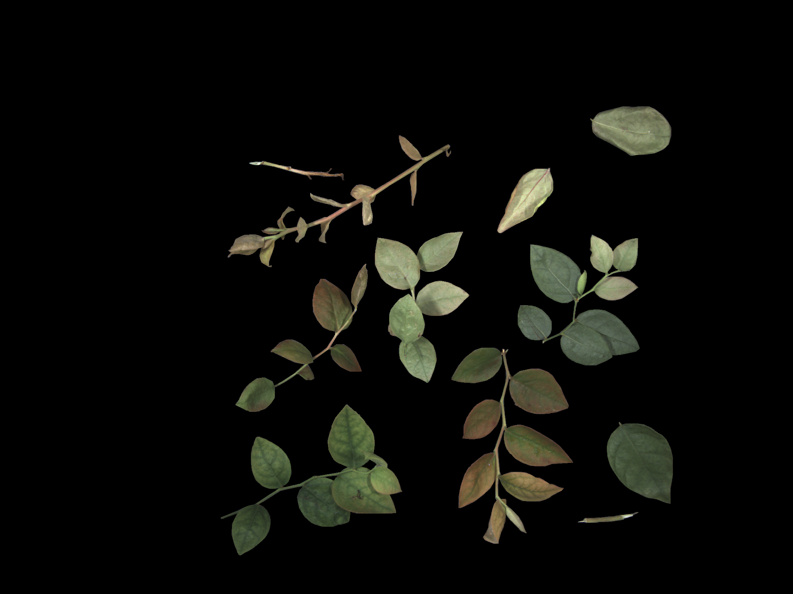
    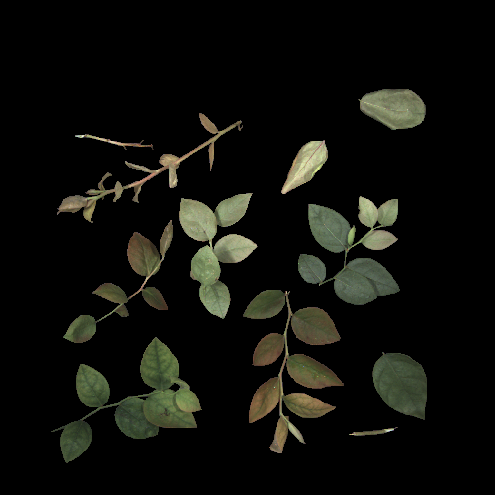

 (a) Original Image (b) Instance Segmentation of Original Image (c) Grayscale image of Instance segmentation image (d) Foreground Segmented Image (e) Final Cropped Image

### Foreground Segmentation using Hsv color conversion

    
    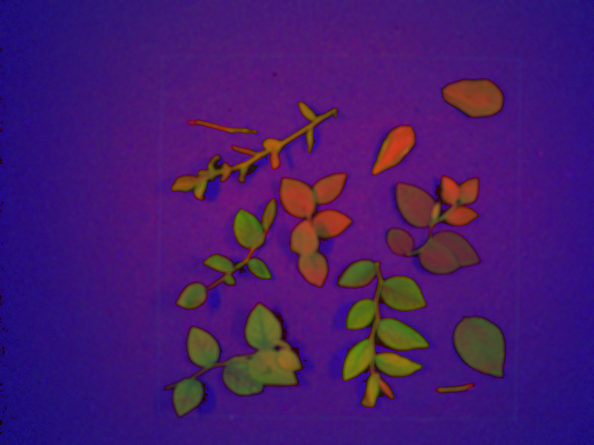
    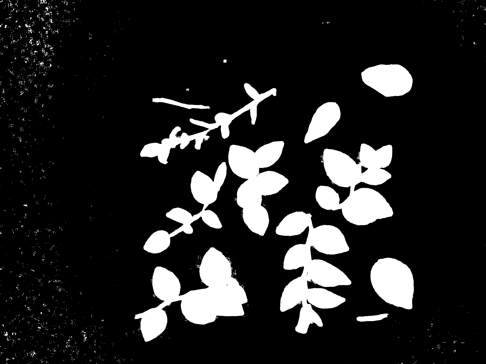
    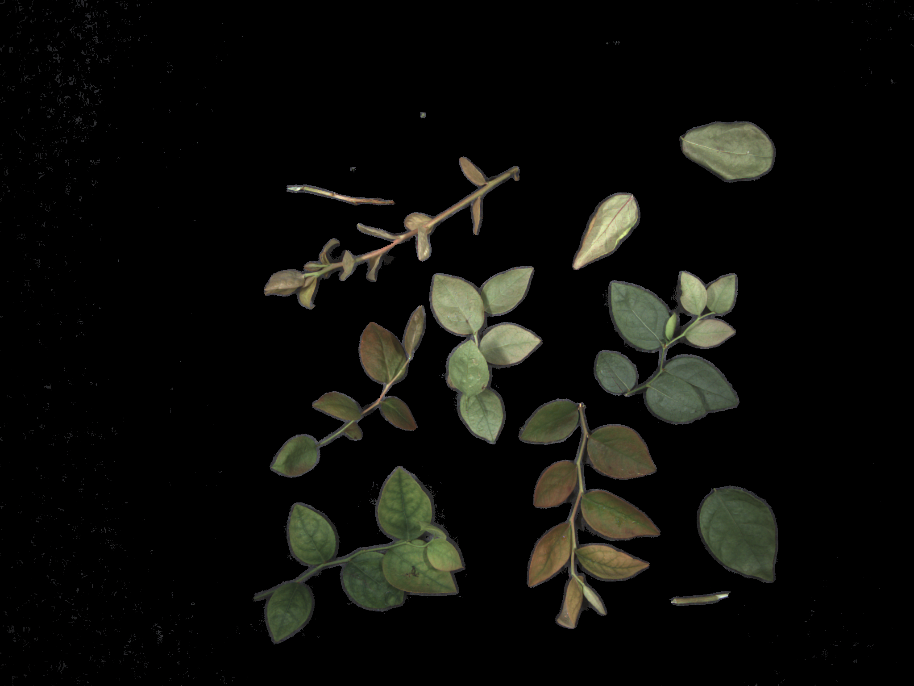

 (a) Original Image (b)Image converted to HSV color scale from RBG (c) Extract plant mask based on color range  (d) Bitwise multiply original image and plant mask

# Model Architecture 
## Generator and Discriminator Architecture

    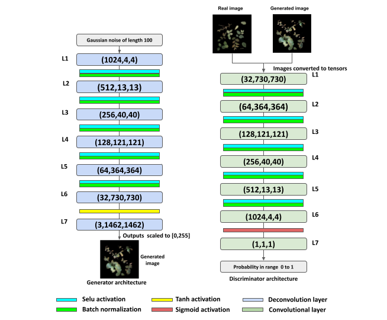

## Loss graph 
### Generator and Discriminator losses during trainig

    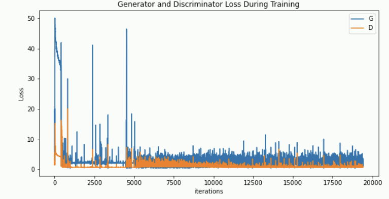

# Generated Images
### Generated Images for 1536 X 1536 dimension

    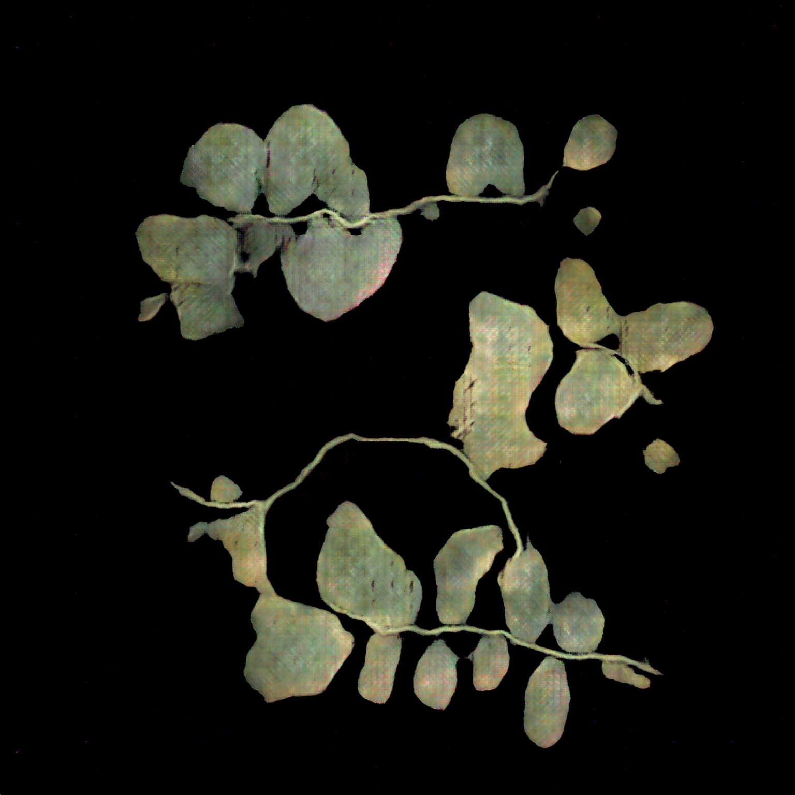
    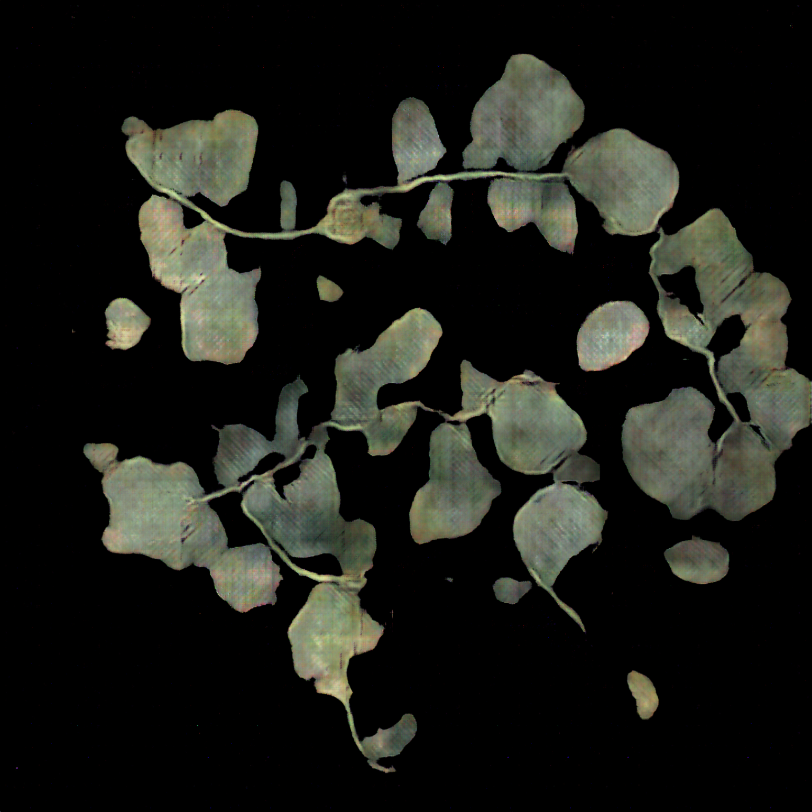

### Generated Images for 1024 X 1024 dimension

    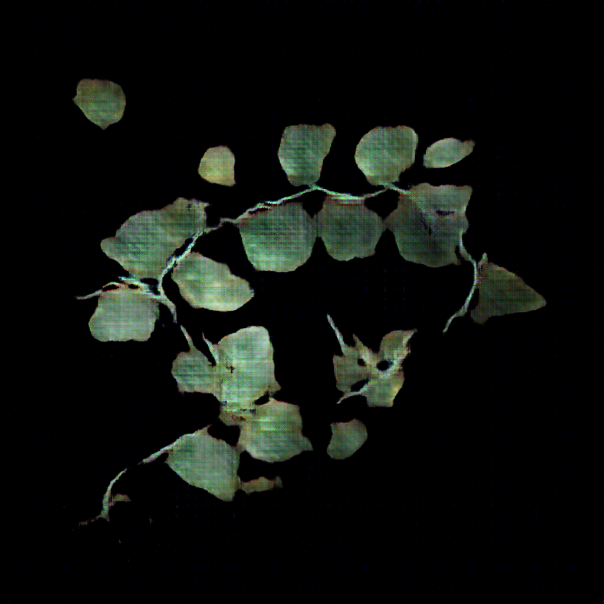
    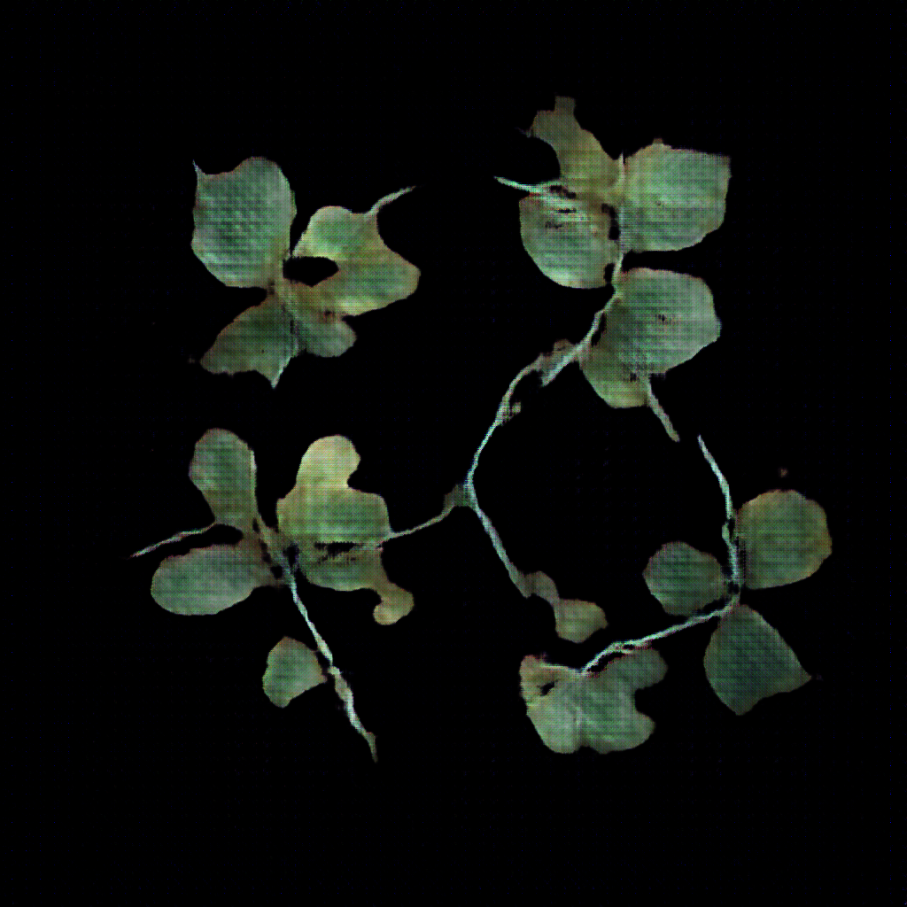

### Generated Images for 256 X 256 dimension

    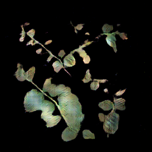
    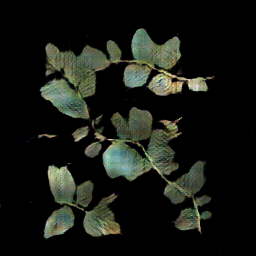

### Generated Images for 64 X 64 dimension

    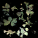
    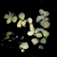

## Required Libraries
- python 3.9.7
- torch 1.10.2
- torchvision 0.11.3
- matplotlib 3.5.0
- opencv-python 4.5.5.62

## Host Machine Specifications
- Ubuntu 20.04.1 LTS
- Processor : AMD Ryzen 9 5950x 16-core processor X 32
- RAM memory : 62.7 GB
- GPU memory : 12 GB

## Author 
> Jayanth Somashekaraiah \
> Universität Bremen, Bremen\
> Email: jayanth@uni-bremen.de 
