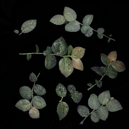
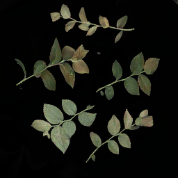
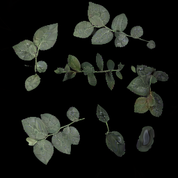
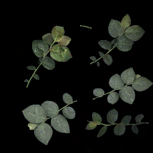
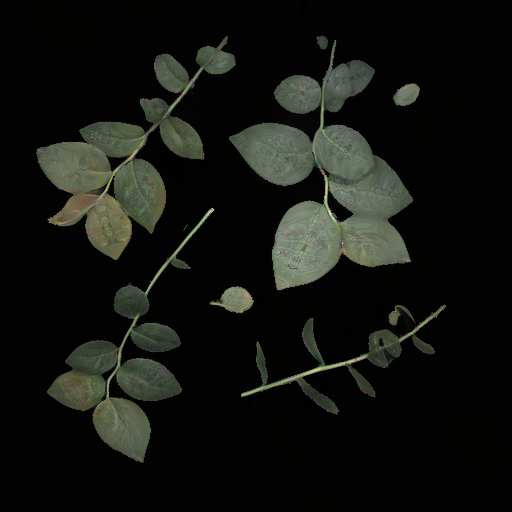
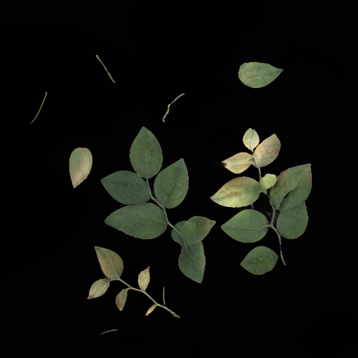
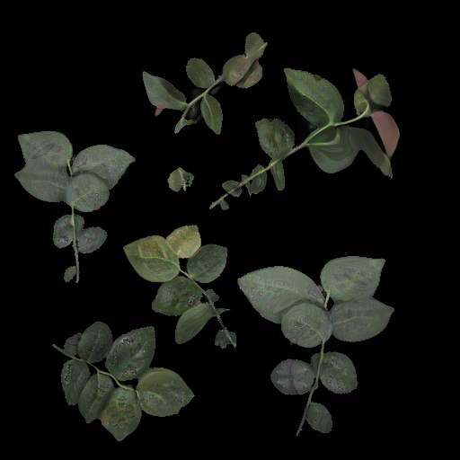

# Style GAN 3
 
parent github repository - [Official PyTorch implementation of StyleGAN3](https://github.com/NVlabs/stylegan3)

## Recommended Research Papers
| Name    | link    |
| :-----: | :-----: |
|    Alias-Free Generative Adversarial Networks ( Style GAN 3) |   https://arxiv.org/abs/2106.12423      |
|      Training Generative Adversarial Networks with Limited Data  ( Style GAN 2 - ADA)                   |       https://arxiv.org/abs/2006.06676                     |
|       Analyzing and Improving the Image Quality of StyleGAN ( Style GAN 2)                     |              https://arxiv.org/abs/1912.04958              |
|              A Style-Based Generator Architecture for Generative Adversarial Networks ( Style GAN )              |           https://arxiv.org/abs/1812.04948                 |
|               Style Mixer: Semantic-aware Multi-Style Transfer Network             |              https://arxiv.org/abs/1910.13093              |
|          Progressive Growing of GANs for Improved Quality, Stability, and Variation                  |       https://arxiv.org/abs/1710.10196                     |
|          Unsupervised Representation Learning with Deep Convolutional Generative Adversarial Networks ( DCGAN)                 |      https://arxiv.org/abs/1511.06434                      |
|          Generative Adversarial Networks ( GAN )                  |           https://arxiv.org/abs/1406.2661                 |

## Requirements for setting up StyleGAN 3
- Linux and Windows is supported.
- 1-8 high end NVIDIA GPUs with atleast 12 GB of memory.
- python 3.8 64-bit 
- Pytorch 1.9.0
- CUDA toolkit 11.1
- GCC 7 or later ( Linux )
- conda 4.13.0 or later 

## Setup StyleGAN3 on local machine
### Clone the Github repository

```
mkdir styleGAN
cd styleGAN
git clone https://github.com/NVlabs/stylegan3.git
```
### Create a conda environment with required libraries
```
conda env create -f environment.yml
```
### Activate conda enviroments
```
conda activte stylegan3
```
### Preparing dataset
For custom images, dataset can be prepared using dataset_tool.py from the repository. Original images with augmentation has to be used for preparing the dataset because the augmentation is performed while preparing dataset. The parameter for the file are follows
- source :  Dataset image folder as a realtive path or system path 
- desitination : the destination folder path 
- resolution : the dimension of can the image can be specified and default is 1024 x 1024 \
more for help : [ python dataset_tool.py --help](https://github.com/NVlabs/stylegan3/blob/main/docs/dataset-tool-help.txt)
```
python dataset_tool.py --source /stylegan3/dataset/plantdata_512 --dest /dataset/dataset_512_2 --resolution=512x512
```

### Training the Style GAN 3
The Style GAN 3 can be trained using train.py file from the repository. Parameter for the file are follows
- outdir : destination folder to save trained models and generated images
- data : dataset image folder 
- cfg : select the configuration of Style GAN 3 . stylegan3-r (rotational) and stylegan3-t (transational) are the two configuration types avaliable.
- gpus : select the number of GPUs training
- batch : select the batch size
- gamma : R1 regularization weight 
- snap : saves the generator model at the specified frequency
- metrics : trains to compute FID score, set to none if not required
- resume : specify the location of the trained model to resume training. delete parameter if not required.\
for more information on training configurations and requried time refer, https://github.com/NVlabs/stylegan3/blob/main/docs/configs.md


```
python train.py --outdir=styleGAN/stylegan3/results_512 --data=styleGAN/stylegan3/dataset/dataset_512 --cfg=stylegan3-r --gpus=1 --batch=32 --gamma=8 --batch-gpu=4 --snap=10 --metrics=none --resume=stylegan3/results_512/00000-stylegan3-r-dataset_512_2-gpus1-batch32-gamma8/network-snapshot-001600.pkl
```

### Generating image from trained model 
gen_images.py is used to generte images from trained model, the parameters for the file are as follows
- outdir : destination folder for generated images
- network : specify the location of the trained model \
for more information of configurations refer, https://github.com/NVlabs/stylegan3/blob/main/gen_images.py
```
python gen_images.py --outdir=styleGAN/stylegan3/512_images/ --trunc=1 --seeds=2 
    --network=styleGAN/stylegan3/results_512/00000-stylegan3-r-dataset_512_2-gpus1-batch32-gamma8/network-snapshot-001600.pkl
```


## Plant Segmentation images generated from trained StyleGAN 3
### 256 X 256 Image dimensions
<div style="text-align: center;">
    
    
    
    
</div>

### 512 X 512 Image dimensions
<div style="text-align: center;">
    
    
    
    
</div>

## Author 
> Jayanth Somashekaraiah \
> Universität Bremen, Bremen\
> Email: jayanth@uni-bremen.de 